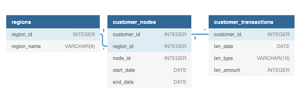

### Contents:
- [Introduction](#introduction)
- [Entity Relationship Diagram](#entity-relationship-diagram)
- [Case Study Questions & Solutions](#case-study-questions--solutions)
  - [A. Customer Nodes Exploration](#a-customer-nodes-exploration)
  - [B. Customer Transactions](#b-customer-transactions)
  - [C. Data Allocation Challenge](#c-data-allocation-challenge)
  - [D. Extra Challenge](#d-extra-challenge)
- [Extension Request](#extantion-request)


### Introduction

> Data Bank is a cutting-edge initiative that merges the worlds of digital-only neo-banks, cryptocurrency, and secure data storage. Unlike traditional banks, Data Bank provides its customers not only with financial services but also with highly secure, distributed cloud storage directly tied to their account balances.
>
>The goal of this case study is to explore customer data, calculate key metrics, and analyze trends to help the management team improve customer growth strategies and optimize data storage forecasting for future scalability.

### Entity Relationship Diagram

<details>
  <summary><em>show database schema <b>*</b></em></summary>

```SQL
CREATE SCHEMA data_bank;
SET search_path = data_bank;

CREATE TABLE regions (
  region_id INTEGER,
  region_name VARCHAR(9)
);

CREATE TABLE customer_nodes (
  customer_id INTEGER,
  region_id INTEGER,
  node_id INTEGER,
  start_date DATE,
  end_date DATE
);

CREATE TABLE customer_transactions (
  customer_id INTEGER,
  txn_date DATE,
  txn_type VARCHAR(10),
  txn_amount INTEGER
);
```

**\*Note**: Primary keys are not explicitly defined in the tables, likely due to the educational nature of the project.
- The data is artificially generated and static, minimizing the risk of integrity violations.
- In real-world scenarios, defining primary keys is essential to ensure data integrity and uniqueness.

</details>





### Case Study Questions & Solutions
#### A. Customer Nodes Exploration

**1. How many unique nodes are there on the Data Bank system?**

*query:*

```SQL
SELECT
  COUNT(DISTINCT node_id) AS unique_nodes_ammount
FROM
  customer_nodes;
```

<details>
  <summary><em>show description</em></summary>

The SQL query calculates the total number of unique `node_id` values in the `customer_nodes` table.

- `COUNT(DISTINCT node_id)`: Counts only the distinct (unique) `node_id` values, ensuring duplicates are not included in the result.
- `AS unique_nodes_ammount`: Assigns an alias to the resulting column for better readability.

</details>

*answer:*

| unique_nodes_ammount |
| -------------------- |
| 5                    |

**2. What is the number of nodes per region?**

*query:*

```SQL

```

<details>
  <summary><em>show description</em></summary>


</details>

*answer:*


**3. How many customers are allocated to each region?**

*query:*

```SQL

```

<details>
  <summary><em>show description</em></summary>


</details>

*answer:*


**4. How many days on average are customers reallocated to a different node?**

*query:*

```SQL

```

<details>
  <summary><em>show description</em></summary>


</details>

*answer:*


**5. What is the median, 80th and 95th percentile for this same reallocation days metric for each region?**

*query:*

```SQL

```

<details>
  <summary><em>show description</em></summary>


</details>

*answer:*


#### B. Customer Transactions
...

#### C. Data Allocation Challenge
...

#### D. Extra Challenge
...

### Extension Request
... 